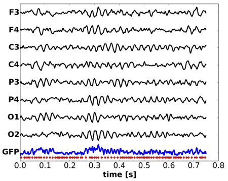

# Resting-state EEG

Multi-channel EEG activity is usually analyzed by looking at the set of single channel time series:



Multivariate time series are difficult to visualize. In motion, surface electrical activity looks more like this:

<video src="S029R02_avgref_t1000-2000_graph.mp4" width="380" height="380" controls preload></video>

The animation is slowed down 6.4 times compared to real-life oscillations. In other words, the 40 second animation represents 6.25 seconds real EEG time.
The oscillatory activity over the occipital part of the brain has a main frequency of 9 Hz, i.e. within the alpha frequency band (8-12 Hz). 

<!--
See more at the [example site](page1.md)
-->


## EEG microstate analysis

The 1-40 Hz oscillation is shown on the left, and the corresponding microstate on the right.

<video src="S029R02_avgref_t1000-2000_microstates.mp4" width="760" height="380" controls preload></video>

### Clustering methods

Here's an example:  
<!--

-->

<!--
<script>
  console.log("js-test");
  alert("test!");
</script>
-->

<!--
<p><div id="copypaste" style="display: block;"> Paste your data into the box: 
<input type="text" id="paste-input" placeholder=">>> data here <<<">
</div></p>
<div><button type="button" id="btn-parse" onclick="parseInput();"> Parse input </button></div>
<p><div id="output-sequence-in"><strong>Parsed sequence: </strong></div></p>
<p><div id="output-symbols-parsed"><strong>Parsed symbols: </strong></div></p>
<p><div id="output-symbols-mapped"><strong>Mapped symbols: </strong></div></p>
<p><div id="output-sequence-mapped"><strong>Mapped sequence: </strong></div></p>
-->

<!--
and the mp4 version:
-->


$$
\begin{align*}
  I(\tau) & = H(X_{t+\tau}) - H(X_{t+\tau} \vert X_{t})
\end{align*}
$$

<!--
https://lyk6756.github.io/2016/11/25/write_latex_equations.html
$$
\begin{align*}
  & \phi(x,y) = \phi \left(\sum_{i=1}^n x_ie_i, \sum_{j=1}^n y_je_j \right)
  = \sum_{i=1}^n \sum_{j=1}^n x_i y_j \phi(e_i, e_j) = \\
  & (x_1, \ldots, x_n) \left( \begin{array}{ccc}
      \phi(e_1, e_1) & \cdots & \phi(e_1, e_n) \\
      \vdots & \ddots & \vdots \\
      \phi(e_n, e_1) & \cdots & \phi(e_n, e_n)
    \end{array} \right)
  \left( \begin{array}{c}
      y_1 \\
      \vdots \\
      y_n
    \end{array} \right)
\end{align*}
$$
-->


<!---
[UNSW](https://medicalsciences.med.unsw.edu.au/research/groups/translational-neuroscience-facility)  
and ...  
-->

<!---

-->

You can use the [editor on GitHub](https://github.com/Frederic-vW/Frederic-vW.github.io/edit/master/index.md) to maintain and preview the content for your website in Markdown files.

Whenever you commit to this repository, GitHub Pages will run [Jekyll](https://jekyllrb.com/) to rebuild the pages in your site, from the content in your Markdown files.

Absolute links:
Try the code for yourself (opens in new window): [online analysis](analyze.html){:target="_blank" rel="noopener"}

| Column-1  | Column-2  | Column-3 |
|:----------|:----------|:---------|
| 1         | A         | abc      |
| 2         | B         | bcd      |
| 3         | C         | cde      |
| 4         | D         | def      |


```markdown
### Statistical characteristics of microstate sequences

Microstate sequences can characterized by the probability distribution of the microstate labels, and the transition matrix $T$, which contains the conditional probabilities of a transition from label $S_i$ at time $t$ to label $S_j$ at time $t+1$.

### Markovianity
A stationary first-order Markov process is fully described by its initial symbol distribution $p_0$, and its transition matrix $T_{ij}$.

### Microstate periodicity

Markdown is a lightweight and easy-to-use syntax for styling your writing. It includes conventions for

- Bulleted
- List

1. Numbered
2. List

**Bold** and _Italic_ and `Code` text

[UNSW](https://medicalsciences.med.unsw.edu.au/research/groups/translational-neuroscience-facility)  
and  

```

For more details see [GitHub Flavored Markdown](https://guides.github.com/features/mastering-markdown/).

### Jekyll Themes

Your Pages site will use the layout and styles from the Jekyll theme you have selected in your [repository settings](https://github.com/Frederic-vW/Frederic-vW.github.io/settings). The name of this theme is saved in the Jekyll `_config.yml` configuration file.

### Support or Contact

Having trouble with Pages? Check out our [documentation](https://help.github.com/categories/github-pages-basics/) or [contact support](https://github.com/contact) and we’ll help you sort it out.
