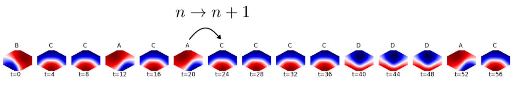
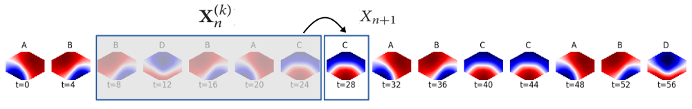
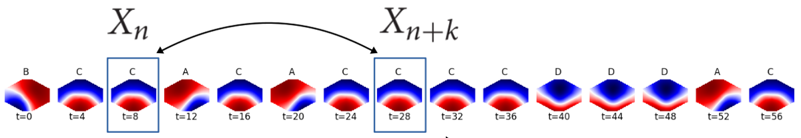

# Resting-state EEG patterns

Multi-channel EEG recordings are often visualized as an array of time series, reflecting the voltage time course at each electrode. The figure below shows 10 seconds of EEG activity, recorded with 30 electrodes. This sample shows typical eyes-closed brain activity in a task-free ("resting-state") condition, with alpha frequency band oscillations (8-12 Hz) over the occipital electrodes (O1, O2).


While temporal patterns like oscillations are clearly seen, the spatial ordering is more difficult to reconstruct visually. Animating a short segment (1.2 seconds) of the same recording, surface electrical activity looks like this:

<p align="center">
<video src="mov/20080514_t24000-24300_graph_1_30.webm" width="380" height="380" controls preload></video>
</p>

The animation was slowed down 25 times with regard to real time. In other words, 1.2 seconds real time are expanded to a 30 second animation. Voltage is represented by colour, the blue-red spectrum covers the range [-33 µV, +23 µV]. 


## EEG microstates
The aim of EEG microstate analysis is to describe the variety of EEG patterns shown above by a small set of representative patterns ([Michel2018](#ref1)).

### Clustering
These representative EEG topographies (microstates) are computed via a clustering algorithm, whose input are EEG data vectors taken at peaks of the GFP time course. A popular choice in this context is a modified K-means algorithm ([Pascual-Marqui1995](#ref2)). With 30 EEG channels, as shown above, clustering occurs in a 30-dimensional space which is impossible to visualize. A two-dimensional visualization of the clustering is shown below, obtained from the [t-SNE algorithm](https://scikit-learn.org/stable/modules/generated/sklearn.manifold.TSNE.html){:target="_blank" rel="noopener"}.
Each of the four microstates is represented with a different colour (microstate class A: black, B: blue, C: red, D: yellow):

<p align="center">

</p>
<!--

-->

In two dimensions, the data points do not show a nice clustering behaviour. Data points assigned to the same microstate cluster (same colour) form coherent groups in the plot, but their separation into four clusters seems is not obvious. This is partially due to the reduction to 2 dimensions, but also due to the continuous nature of EEG topographic patterns, as will be shown below.

The microstates found are labelled ms-A,..., ms-D, following a commonly used convention ([Michel2018](#ref1)). Plotting the cluster centers as if they were real EEG topographies on the head surface, the microstate maps look like this:

<p align="center">

</p>

The colour bars below each map correspond to the colours used in the tSNE visualization above.

If we accept the clustering, the EEG data set can now be represented by a sequence of microstates. Instead of using the voltage values at each of the 30 electrodes and each moment, we use the microstate label (A-D) that best matches the voltage distribution at that time. The similarity between the current EEG vector and each microstate is measured by their *squared* correlation coefficient, thus ignoring polarity.  
The 1.2 second EEG segment animated above, for example, is defined by an array of 9000 floating point values (300 samples x 30 channels). The microstate algorithm reduced that to a sequence of 300 microstate labels. The first 100 entries of the microstate sequence representing the EEG segment animated above are: BBBADBBBBAAAAAAAADDDDDDCCABBBBBBBBBBAADDBBDDDDDBBBBBBBBBBDDABBBBBBBBACCCBBBBBBBDDDDBACCCCBBBBBACCBBB
  
In terms of data compression, the microstate approach reduces 30 64-bit floating point values (one for each EEG channel) to 1 label with 2 bit information (4 labels), or by a factor of 960. This factor increases when more electrodes are used.

What the microstate approach achieves is best shown in an animation (below): the top row is the GFP time course, and the moving yellow dot indicates the current time point. Below, the same 1.2 second EEG segment (1-30 Hz) used above is shown on the left, now spatially interpolated onto a 128 x 128 grid, as an approximation to the real voltage distribution across the head surface. The best fitting microstate is shown on the right. Since the algorithm ignores polarity, a microstate matches when its symmetry is similar to the current EEG topography, even when red/blue are inverted. Usually, the fit is best at local GFP peaks.  
Try and hit pause when the yellow dot is at a GFP peak location, and compare the symmetry of the EEG topography on the left and on the right, and don't forget to ignore polarity!

<video src="mov/20080514_t24000-24300_ms_t.webm" width="760" height="380" controls preload></video>

The microstate approximation is far from perfect, but generally captures 60-80% of the data variance. Despite the heavy compression ratio of 960, some important EEG properties are conserved.

### Microstate sequence analysis
Once the multi-channel EEG data set is compressed into the simple microstate label sequence, the main question is: which EEG properties are reflected by a microstate sequence, and how can they be measured?

#### Microstate distribution and Shannon entropy
Microstate sequences are often characterized by the 'ratio of time covered' (RTT) by each microstate. When divided by the total time of the recording, this is the same thing as the probability of finding a certain microstate in that recording.  
The Shannon entropy of this distribution is defined as $$ H(X) = -\sum_i p_i \log_2 p_i $$, where $$p_i$$ are the probabilities of the microstate labels $$i \in {A,B,C,D}$$.  
The distribution of the microstates A-D in the sample above is (0.16, 0.53, 0.11, 0.2), and is shown below (center). The Shannon entropy of this distribution is H=1.72 bit. Is that a small or large entropy value? The minimum entropy is H_{min}=0 bit, and occurs when exactly one of the labels has probability one, for example p_B=1 (could as well be p_A, or any other), and all others have probability zero. This case is shown on the left, and means that the occurrence of microstate B is absolutely certain, so the entropy (uncertainty) is zero. Maximum entropy occurs when all microstates have the same probability (maximum uncertainty of which state will occur). In the case of 4 microstates, this means $$p_A=...=p_D=\frac{1}{4}$$, and $$H_{max}=-4 \times \frac{1}{4} \log_2 \left( \frac{1}{4} \right) = 2$$.

<p align="center">

</p>


#### Transition matrix and relaxation time
Distribution and Shannon entropy completely ignore the temporal structure of the microstate sequence. A randomly shuffled sequence yields exactly the same values.
To describe the temporal structure of a microstate sequence, the most elementary concept is the transition probability matrix $$T$$. The matrix element $$t_{ij}$$ is the conditional probability that microstate label $$i$$ occurs at time $$n$$, and precedes label $$j$$ at time $$n+1$$. In the case of 4 microstates, there are 16 different transitions, $$A \rightarrow A$$, $$A \rightarrow B$$, $$A \rightarrow C$$ etc.  

<p align="center">

</p>

To estimate these conditional probabilities, all transitions are counted, and the matrix rows are normalized to have a row sum of 1.  
Large values (close to 1) along the diagonal indicate many self transitions, i.e. we find long segments of the same label, e.g. ...CCCCCC... if $$t_{CC}$$ is close to 1.  
How quickly a process with a transition matrix $$T$$ approaches its equilibrium is described by its relaxation time $$\tau_r$$, which is defined in terms of the two largest eigenvalues of $$T$$. By construction, $$T$$ is a stochastic matrix ($$\sum_j T_{ij}=1$$), and its larges eigenvalue is $$\lambda_0 = 1$$. The larger the difference between $$\lambda_0$$ and the second largest eigenvalue $$\lambda_1$$, the shorter is the relaxation time, which is defined as $$\tau_r = \frac{1}{1-\lambda_1}$$.  

#### The Markov property
When the occurrence of microstates does not depend on the past, or in other words, when the transition probabilities $$P(X_{n+1} \vert X_n)$$ do not depend on $$P(X_n)$$, the sequence has the zero-order Markov property.  
When the occurrence of a microstate only depends on the preceding microstate, but not on the previous history, the sequence has the first-order Markov property. This means $$P(X_{n+1} \vert X_n, X_{n-1},\ldots) = P(X_{n+1} \vert X_n)$$.


#### Entropy rate
The entropy rate $$h_X$$ of a process measures how much surprise, or uncertainty the time series produces, despite our knowledge of its past. In technical terms uncertainty is measured by entropy, in this case by the conditional entropy of the next microstate, $$X_{n+1}$$, given its past $$k$$ values, or its k-history $$\mathbf{X}_n^{(k)} = (X_n, X_{n-1},\ldots, X_{n-k+1})$$. In theory, the entropy rate should reflect an infinite past ($$k \rightarrow \infty$$), in reality we have to conform with a finite $$k$$:

$$ h_X = H(X_{n+1} \mid \mathbf{X}_n^{(k)}) $$

The idea is illustrated here:
<p align="center">

</p>

Another way to express this concept is to ask how much uncertainty an additional sample adds to an existing collection of microstate samples.
As the entropy rate is the difference between the joint entropies for history lengths $$k+1$$ and $$k$$, it can be estimated as the slope of a plot of joint entropies $$H(\mathbf{X}_n^{(k)})$$ over a range of history lengths $$k$$. The example microstate sequence give an almost perfect linear fit with a slope of 1.149 bits/sample. At an EEG sampling rate of 250 Hz, this equals 287.25 bits/sec or approximately 2 kilobytes per minute.

<p align="center">

</p>

<!--
#### Active information storage
$$ a_X(n,k) = I(X_{n+1} ; \mathbf{X}_n^{(k)}) $$
#### Active information storage
$$ \pi_X(n,k) = I(X_{n+k} ; X_n \mid X_{n+k-1} \ldots X_{n+1}) $$
-->


#### Microstate frequency analysis
For numerical time series, characteristic frequencies appear as peaks in the power spectral density (PSD). Resting state EEG alpha oscillations, for example, produce a PSD peak around 10 Hz, as seen below on the left. The Wiener–Khinchin theorem says that the same information can be expressd by the signal's autocorrelation function (ACF), where 10 Hz oscillations produce periodic peaks at multiples of 100 ms (10.3 Hz and 97 ms for the individual shown). For time lags at which the alpha oscillation is shifted by a half-cycle (50 ms, 150 ms,...), the autocorrelation is negative.

<p align="center">

</p>

Using mutual information as an alternative to linear correlation, the statistical dependence between the microstate samples at times $$n$$ and $$n+k$$ can be expressed by the time-lagged mutual information coefficients:

$$
\begin{align*}
  I_k & = H(X_{n+k}) - H(X_{n+k} \vert X_{n})
\end{align*}
$$

<p align="center">

</p>

In analogy to the autocorrelation function (ACF), we call this the autoinformation function (AIF). For EEG alpha oscillations (10 Hz), we find periodic AIF peaks at multiples of 50 ms and 100 ms (blue curve). In contrast to correlation, information terms are always positive, so negative ACF peaks appear as positive AIF peaks.

<p align="center">

</p>

Autocorrelation analysis cannot be applied to sequences of symbols or labels (sums, products, etc. are not defined), but mutual information analysis is possible. The AIF of the complete (30,000 sample) microstate sequence shows the same peaks as the single electrode voltage timecourse shown above. The time lag corresponding to this individual's alpha frequency is 97 ms.

<p align="center">

</p>
<!--

-->

This demonstrates that the microstates themselves occur with a frequency around 10 Hz, and suggests that the networks associated with these microstate patterns activate periodically over time. If the whole process was determined by the information contained in the transition probability matrix T only, the AIF would decay as the 95\% confidence interval, which was computed from surrogate sequences only defined by T (gray, Markov CI).

### Give it a try!
<!--
coming soon...
-->
Link to the html page: [online microstate analysis](stats.html){:target="_blank" rel="noopener"}  


## Continuous EEG patterns
Microstate frequency analysis shows that microstate labels recur periodically, at the rate of the EEG alpha frequency. This effect can be understood by looking at pure alpha frequency-band oscillations.

### Amplitude and phase patterns
At each EEG electrode, amplitude-modulated oscillations are observed. These can be characterized completely by their analytic amplitude and analytic phase.
All the details can be found in [Wegner2020](#ref2).

#### Phase rotors
The continuous dynamics are animated below. Alpha band activity $$\alpha(\mathbf{r},t)$$ is on the left, the alpha amplitude $$A(\mathbf{r},t)$$ in the center, and the alpha phase $$\phi(\mathbf{r},t)$$ on the right.

<p align="center">
<video src="mov/20080514_t24000-24300_cont.webm" width="750" height="250" controls preload></video>
</p>

Microstates try to capture the ongoing dynamics on the left. When separated into amplitude and phase dynamics, we see that the alpha amplitude changes very slowly and its maximum stays over occipital areas. The analytic phase, however, shows rotating phase patterns, or phase rotors. At the center of each rotor, where all phase values coincide, the phase is not defined, these sites are called phase singularities.

Using a simple phase gradient definition at grid location $$(m,n)$$: 

$$
\begin{align*}
  \nabla \phi_{m,n} & =  \left(\phi_{m+1,n}-\phi_{m,n}, \phi_{m,n+1}-\phi_{m,n}\right)
\end{align*}
$$

we obtain an invariant description of these rotations (blue streamlines in the animation below). 

Phase singularities can be detected efficiently from the topological charge $$\sigma(\mathbf{r},t)$$ of the phase field:

$$
\begin{align*}
  \sigma(\mathbf{r},t) = \frac{1}{2\pi}\oint_{C} \nabla \phi(\mathbf{r},t) \mathrm{dl}
\end{align*}
$$

computed from the integral along any closed contour $$C$$. Counterclockwise rotations of the phase gradient have a positive topological charge ($$\sigma=+1$$, white squares), clockwise rotations a negative charge ($$\sigma=-1$$, black squares).

<p align="center">
<video src="mov/20080514_t24000-24300_phase.webm" width="600" height="300" controls preload></video>
</p>


#### Phase rotors in a computational model
The same phase patterns can be found in a computational model of EEG oscillations ([Wegner2020](#ref3)). Using diffusively coupled oscillators on a square lattice, phase rotors arise spontaneously when the individual oscillators undergo a supercritical Andronov-Hopf bifurcation. The control parameter $$\mu$$ controls the onset of the bifurcation ($$\mu=0$$):

<p align="center">
<video src="mov/CSLE_S2.webm" width="300" height="300" controls preload></video>
</p>

Details are given in ([Wegner2020](#ref3)).


## References
<a name="ref1">[1]</a> Michel, C.M., Koenig, T. (2018). EEG microstates as a tool for studying the temporal dynamics of whole-brain neuronal networks: A review. NeuroImage 180:577-593. [doi.org/10.1016/j.neuroimage.2017.11.062](doi.org/10.1016/j.neuroimage.2017.11.062){:target="_blank" rel="noopener"}

<a name="ref2">[2]</a> Pascual-Marqui, R.D. , Michel, C.M. , Lehmann, D. (1995). Segmentation of brain electrical activity into microstates: model estimation and validation. IEEE Trans. Biomed. Eng. 42(7):658-665. [10.1109/10.391164](10.1109/10.391164){:target="_blank" rel="noopener"}

<a name="ref3">[3]</a> von Wegner, F., Bauer, S., Rosenow, F., Triesch, J., Laufs, H. (2020). EEG microstate periodicity explained by rotating phase patterns of resting-state alpha oscillations. NeuroImage, Sep 24;224:117372. [doi: 10.1016/j.neuroimage.2020.117372](doi: 10.1016/j.neuroimage.2020.117372){:target="_blank" rel="noopener"} 

<a name="ref4">[4]</a> von Wegner, F., Laufs, H. (2018). Information-theoretical analysis of EEG microstate sequences in Python. Frontiers in Neuroinformatics, 12:30. [doi: 10.3389/fninf.2018.00030](doi: 10.3389/fninf.2018.00030){:target="_blank" rel="noopener"} 

<a name="ref5">[5]</a> von Wegner, F., Knaut, P., Laufs, H. (2018). EEG microstate sequences from different clustering algorithms are information-theoretically invariant. Frontiers in Computational Neuroscience, 12:70. [doi: 10.3389/fncom.2018.00070](doi: 10.3389/fncom.2018.00070){:target="_blank" rel="noopener"} 

<a name="ref6">[6]</a> von Wegner, F., Tagliazucchi, E., Laufs, H. (2017). Information-theoretical analysis of resting state EEG microstate sequences - non-Markovianity, non-stationarity and periodicities. NeuroImage, 158:99-111. [http://dx.doi.org/10.1016/j.neuroimage.2017.06.062](http://dx.doi.org/10.1016/j.neuroimage.2017.06.062){:target="_blank" rel="noopener"} 

<!--

-->


<!--
<p><div id="copypaste" style="display: block;"> Paste your data into the box: 
<input type="text" id="paste-input" placeholder=">>> data here <<<">
</div></p>
<div><button type="button" id="btn-parse" onclick="parseInput();"> Parse input </button></div>
<p><div id="output-sequence-in"><strong>Parsed sequence: </strong></div></p>
<p><div id="output-symbols-parsed"><strong>Parsed symbols: </strong></div></p>
<p><div id="output-symbols-mapped"><strong>Mapped symbols: </strong></div></p>
<p><div id="output-sequence-mapped"><strong>Mapped sequence: </strong></div></p>
-->


<!--
https://lyk6756.github.io/2016/11/25/write_latex_equations.html
$$
\begin{align*}
  & \phi(x,y) = \phi \left(\sum_{i=1}^n x_ie_i, \sum_{j=1}^n y_je_j \right)
  = \sum_{i=1}^n \sum_{j=1}^n x_i y_j \phi(e_i, e_j) = \\
  & (x_1, \ldots, x_n) \left( \begin{array}{ccc}
      \phi(e_1, e_1) & \cdots & \phi(e_1, e_n) \\
      \vdots & \ddots & \vdots \\
      \phi(e_n, e_1) & \cdots & \phi(e_n, e_n)
    \end{array} \right)
  \left( \begin{array}{c}
      y_1 \\
      \vdots \\
      y_n
    \end{array} \right)
\end{align*}
$$
-->


<!---
[UNSW](https://medicalsciences.med.unsw.edu.au/research/groups/translational-neuroscience-facility)  
and ...  
-->


<!--
You can use the [editor on GitHub](https://github.com/Frederic-vW/Frederic-vW.github.io/edit/master/index.md) to maintain and preview the content for your website in Markdown files.
Whenever you commit to this repository, GitHub Pages will run [Jekyll](https://jekyllrb.com/) to rebuild the pages in your site, from the content in your Markdown files.
Absolute links:
Try the code for yourself (opens in new window): [online analysis](analyze.html){:target="_blank" rel="noopener"}
-->

<!--
| Column-1  | Column-2  | Column-3 |
|:----------|:----------|:---------|
| 1         | A         | abc      |
| 2         | B         | bcd      |
| 3         | C         | cde      |
| 4         | D         | def      |
-->

<!--
```markdown
### Statistical characteristics of microstate sequences
Microstate sequences can characterized by the probability distribution of the microstate labels, and the transition matrix $T$, which contains the conditional probabilities of a transition from label $S_i$ at time $t$ to label $S_j$ at time $t+1$.
### Markovianity
A stationary first-order Markov process is fully described by its initial symbol distribution $p_0$, and its transition matrix $T_{ij}$.
### Microstate periodicity
Markdown is a lightweight and easy-to-use syntax for styling your writing. It includes conventions for
- Bulleted
- List
1. Numbered
2. List
**Bold** and _Italic_ and `Code` text
[UNSW](https://medicalsciences.med.unsw.edu.au/research/groups/translational-neuroscience-facility)  
and  

```
-->

<!--
For more details see [GitHub Flavored Markdown](https://guides.github.com/features/mastering-markdown/).
-->

<!--
### Jekyll Themes
Your Pages site will use the layout and styles from the Jekyll theme you have selected in your [repository settings](https://github.com/Frederic-vW/Frederic-vW.github.io/settings). The name of this theme is saved in the Jekyll `_config.yml` configuration file.
-->
<!--
### Support or Contact
Having trouble with Pages? Check out our [documentation](https://help.github.com/categories/github-pages-basics/) or [contact support](https://github.com/contact) and we’ll help you sort it out.
-->
